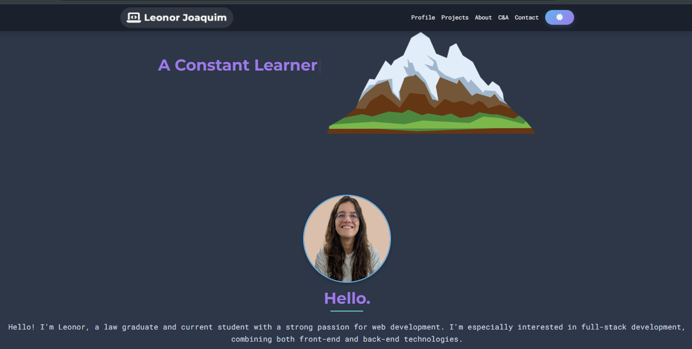
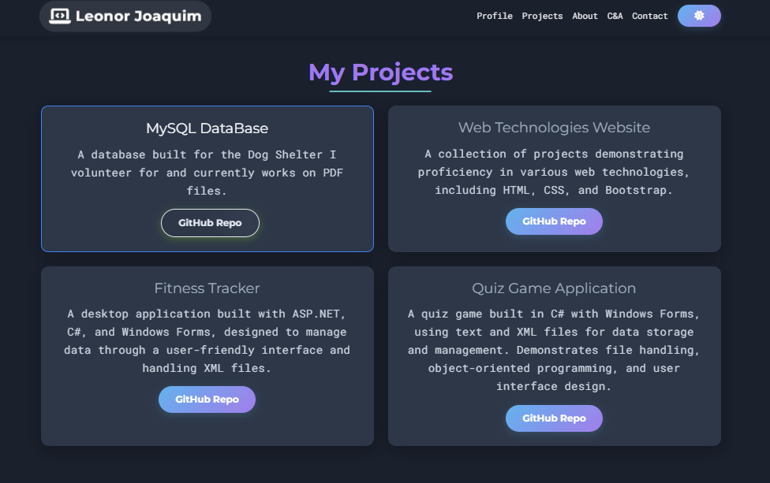
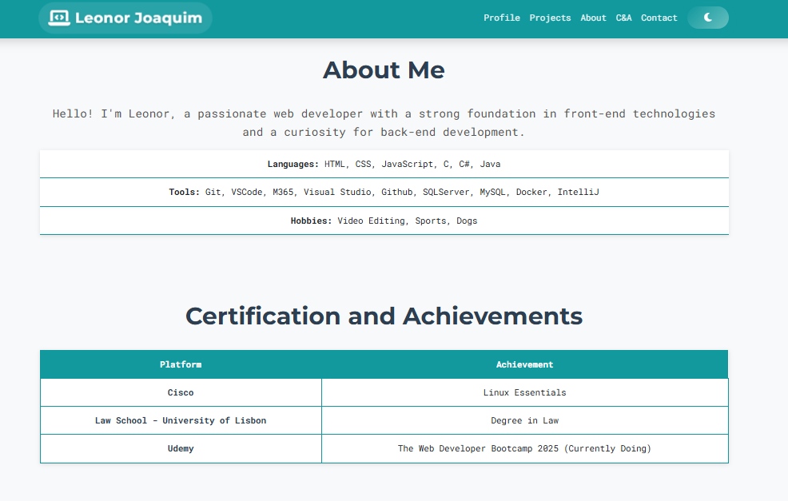

# 🌐 Portfolio - Leonor Joaquim

This project is a school portfolio website created as part of my learning journey to practice working with Git and GitHub.
It is built to experiment with HTML, CSS, JavaScript, and external libraries like Bootstrap and Typed.js, while implementing features such as responsiveness, animations, theme switching for light/dark mode, interactive components, and project showcases.

## 🧠 The Idea and Why I Chose this Portfolio
For school, we were asked to clone a public portolio and change it to be our own portfolio. The catch being that we 
weren't being evaluated on how the portfolio looked and the technologies we used, but rather on how we used git to 
make our changes and the different branches and commits we did in order to make the portfolio our own.

I chose this portfolio mainly because I understood the languages and frameworks being used, and was able to learn new ones
such as **Font Awesome** and **Typed.js**.

Since the project had mainly three files, namely: 
- `index.html`  
- `style.css` (including the dark mode version)  
- `script.js`  

The **idea** was to create a dedicated branch for each of these files, and within those branches, the commits would have 
meaningful messages on what was actually changed - following the [Conventional Commit Messages](https://gist.github.com/qoomon/5dfcdf8eec66a051ecd85625518cfd13).

For that reason, all major changes were done in `feat/*` branches, while smaller, ongoing fixes to the documentation were handled in `docs/*` branches.  

---

## 🚀 Features

- **Responsive navigation** with a dynamic navbar.
- **Typing animation effect** (using Typed.js library).
- **Scroll animations**
- **Light/Dark theme toggle**
- **Interactive profile image** with a coin flip effect.
- **3D carousel slider** for main projects I've built.
- **Smooth "Back to Top" button** with animation.
- **Interactive project cards** with hover effects.
- **Dedicated sections**:
  - Profile
  - Projects
  - About Me
  - Certifications & Achievements
  - Featured Work
  - Contact & Social Media

---

## ✨ Live Preview
In case you wanna check it live with github pages 🚀 Everytime I push into main, it automatically updates the website into the new version.

https://leonormcjoaquim.github.io/UC00617_Projeto1/ 

## 🛠️ Technologies Used

- **Frontend:**
  - HTML5
  - CSS3
  - Bootstrap 5
  - JavaScript ES6+

- **External libraries:**
  - [Font Awesome](https://fontawesome.com/) → icons
  - [Typed.js](https://github.com/mattboldt/typed.js/) → typing animation
  - [Google Fonts](https://fonts.google.com/) → fonts for the typography

---

## 📂 Project Structure

```bash
├── index.html        # Main structure of the site
├── style.css         # Main styles (light theme)
├── dark-theme.css    # Dark mode styles
├── script.js         # Logic and interactivity
├── images/           # Portfolio images
```

## ⚙️ How to Run Locally

1. Clone the repository:

```bash
   git clone https://github.com/leonormcjoaquim/UC00617_Projeto1
```

2. Make your way into the Portfolio directory, either on windows or CD into it. 

3. Open the **index.html** file directly in your browser, or run it with Live Server (VSCode extension).


## 📸 Demo (Screenshots)
Profile 

---

My Projects

---

Certifications and Achievements 

---

## 📧 Contact Me
- **Email:** [leonor@example.com](mailto:leonor@example.com)
- **GitHub**: [leonormcjoaquim](https://github.com/leonormcjoaquim)
- **LinkedIn:** [Leonor Joaquim](https://www.linkedin.com/feed)

## 📜 License

This project is licensed under the MIT License - feel free to use and modify it for your own purposes.
